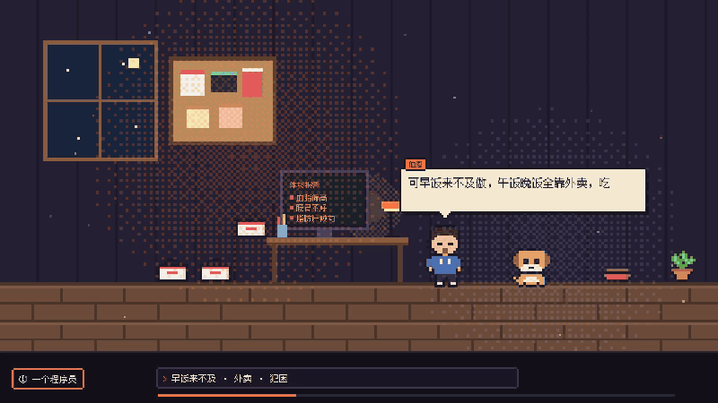
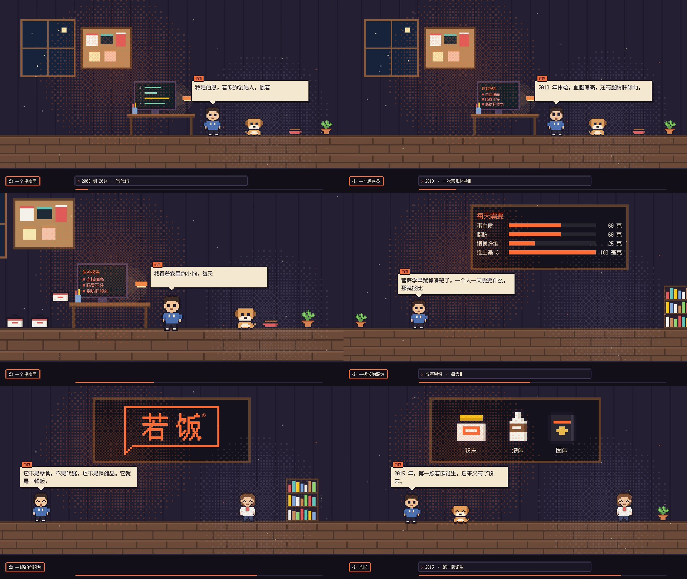

# 像素小剧场 pixel-theater

用 Claude Code 写一份脚本，生成像素风的剧情短片。



▶ **完整版样片（带配音和音乐）：[在 X 上观看](https://x.com/rfboen/status/2108186704335311094)**

一个横向的像素房间，角色在里面走位、说话、换表情，墙上的屏幕跟着剧情换内容，镜头在房间里平移推近。
对白框里的字跟着配音逐字打出来，底部有章节牌和导演控制台，开场和结尾用抖动光圈收放，背景是 chiptune 音乐。

整条片子只是一份 TypeScript 脚本（纯数据），画面、时长、字幕都从脚本和配音算出来。
你只要用中文告诉 Claude Code 想讲什么故事，它会照着仓库里的 `CLAUDE.md` 写分镜、配音、配乐、渲染、自检。

## 效果

仓库自带一条完整的样片：**若饭品牌故事《从一碗狗粮说起》**，横版 1080p，约 65 秒，12 句第一人称旁白。
成片可以[在 X 上看完整版](https://x.com/rfboen/status/2108186704335311094)，也可以自己渲染：



```bash
npm run render -- ruffood-story        # 成片在 out/ruffood-story/landscape.mp4
```

## 能做什么

- **一个连续的世界**：脚本顶层定义房间、布景和角色，每场是其中的一拍。场与场硬切，但谁走到哪、屏幕上是什么都会接着往下演，看起来是一个长镜头。
- **配音驱动时长**：每场多长由配音实测时长决定，改了台词重新合成，画面自己跟上。不用手抄秒数。
- **对白框就是字幕**：按 edge-tts 给的词级时间戳逐字打，念到哪打到哪。
- **会演的角色**：呼吸、眨眼、说话时动嘴、开口时跳一下、走路、转身，表情有平静、笑、闭眼、瞪眼四种。自带程序员、营养师、小狗、机器人、果冻、猫六个原创角色。
- **会变的屏幕**：桌上的显示器和墙上的大屏可以放代码、清单、条形图、文字、像素道具、图片，每次切换都有逐行或逐格的动画。
- **整套像素风**：像素字体（带简体中文）、缺角像素框、10fps 逐格动画、Bayer 抖动网点光、方块溶解转场、chiptune 音床生成器。
- **不只是小剧场**：另外还有 14 种通用场景（标题、要点、数字墙、价格页、截图巡览等），脚本里写 `theme: pixelTheme` 就全部换成像素风。

## 环境

| 需要 | 用来 | 安装 |
|---|---|---|
| Node.js 20 以上 | 跑 Remotion | <https://nodejs.org> |
| ffmpeg | 配音裁剪、响度归一化、验收 | `brew install ffmpeg` |
| uv | 现拉现跑 edge-tts，不用自己配 Python 环境 | `brew install uv` |
| Python 3 + numpy | 生成 chiptune 音床 | `pip3 install numpy` |

渲染时 Remotion 会自动下载一个无头 Chrome，第一次会慢一点。配音用的是微软 edge-tts，需要联网，免费，不要账号。

## 快速开始

```bash
git clone https://github.com/ruffood/pixel-theater.git
cd pixel-theater
npm ci                                   # 用 npm，版本已锁死

npm run studio                           # 浏览器里预览所有片子，可以拖时间轴
npm run render -- ruffood-story --still 30   # 截第 30 秒一帧，几秒出图
npm run render -- ruffood-story          # 渲整片
```

## 用 Claude Code 做一条新片

在仓库目录里打开 Claude Code，直接说你要什么，比如：

> 帮我做一条一分钟左右的像素小剧场，讲我们咖啡店是怎么开起来的。老板是个前程序员，主角是他和店里的猫。我先把故事发给你。

Claude Code 会读 `CLAUDE.md`，按下面的顺序干活，每一步都会停下来让你看：

1. 把故事压成十来句旁白，一句一场，排出分镜（谁说话、镜头在哪、屏幕上放什么）
2. `npm run new` 开项目，写布景、角色和每一场
3. 写 `voice.json`，合成配音，用实测时长接回脚本
4. 按片长生成 chiptune 音床
5. 逐场截图检查版面，渲整片，量响度和画面有没有静止

想自己动手也行，流程和命令都在 [`docs/像素小剧场.md`](docs/像素小剧场.md)。

## 一场戏长什么样

```ts
{
  id: 'checkup',
  type: 'stage',
  console: '2013 · 一次常规体检',                 // 底部控制台逐字打出
  line: {who: 'bern', text: '2013 年体检，血脂偏高，还有脂肪肝倾向。'},
  cues: [
    {at: 0.05, screen: 'desk', show: {kind: 'list', title: '体检报告', items: [
      {text: '血脂偏高', tone: 'bad'},
      {text: '脂肪肝倾向', tone: 'bad'},
    ]}},
    {at: 0.3, face: 'bern', mood: 'wide'},       // 本场 30% 处瞪大眼
  ],
}
```

`at` 是本场里的位置（0 到 1），不是秒数，所以改了台词、配音时长变了，动作也不用重排。

## 目录

```
src/kit/              通用积木：场景、主题、动效、像素组件
  pixel/              像素风：角色、道具、布景、背景、转场、世界状态
  scenes/Stage.tsx    像素小剧场
src/projects/         一条片子一个目录（script.ts + voice.json）
  ruffood-story/      样片：若饭品牌故事
  _pixel/stage.ts     小剧场模板，npm run new 从这里复制
  _pixel/script.ts    其余 14 种场景的像素风样例
scripts/              渲染、配音、音床、开新片
public/               配音、音乐、图片
docs/像素小剧场.md     完整用法
CLAUDE.md             给 Claude Code 的作业规程
```

## 许可

- **本仓库代码**：MIT，见 [LICENSE](LICENSE)。
- **Remotion 不是 MIT**：个人、3 人以内的公司、非营利组织可以免费使用（包括商用）；超过这个规模的公司需要购买 Remotion 的公司授权。用之前请读 [Remotion License](https://www.remotion.dev/license)。
- **像素字体**：[Fusion Pixel Font](https://github.com/TakWolf/fusion-pixel-font)，作者 TakWolf，SIL Open Font License 1.1，许可文本在 `src/kit/assets/fusion-pixel/OFL.txt`。
- **若饭样片素材**：`public/brands/ruffood/` 里的标志、`public/audio/ruffood-story/` 里的配音、样片文案归若饭所有，只供参考学习，不在 MIT 授权范围内。做自己的片子请换成自己的素材。

## 致谢

- 镜头语法的灵感来自 B 站 UP 主「路北路陈」的设计科普系列番外（讲这个系列是怎么用 AI 做出来的那一期）：一个连续的像素房间、角色对白框、底部导演栏、抖动光圈。本仓库的代码和角色都是另外写、另外画的。
- [Remotion](https://www.remotion.dev)、[Fusion Pixel Font](https://github.com/TakWolf/fusion-pixel-font)、[edge-tts](https://github.com/rany2/edge-tts)。
